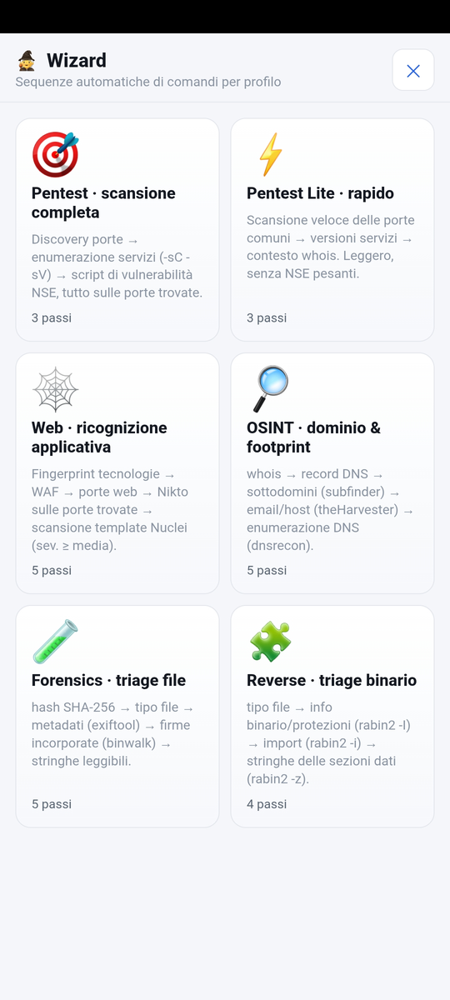
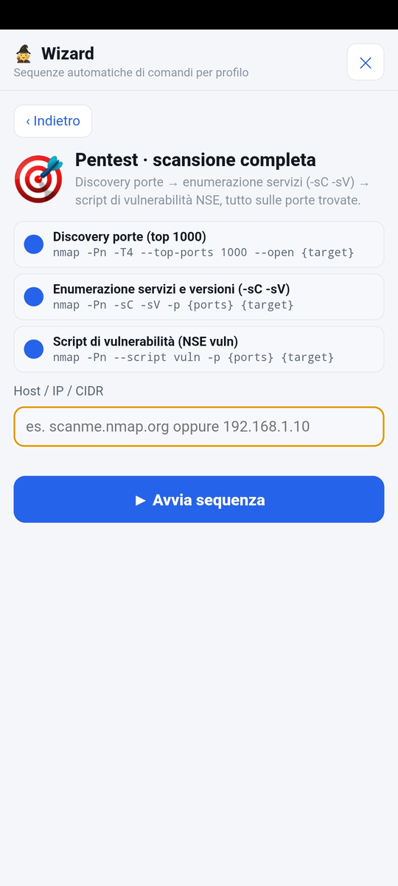
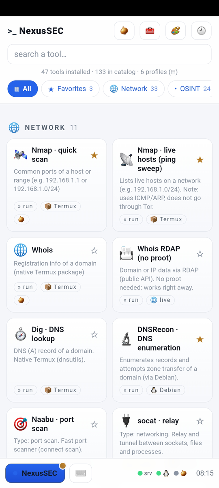
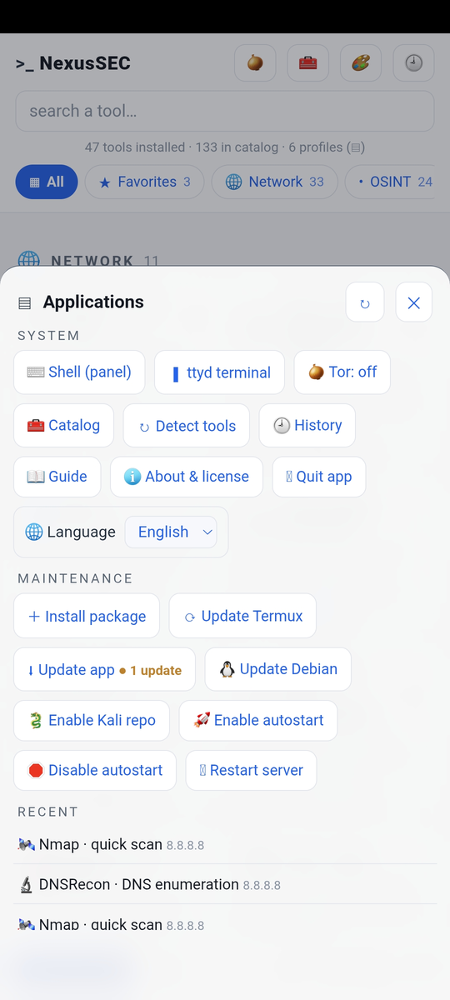
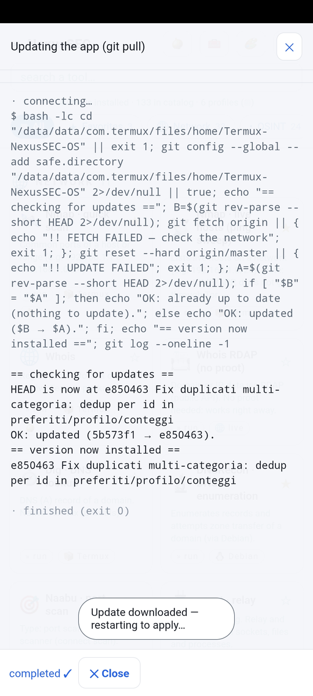
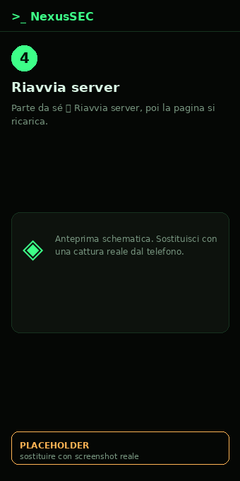
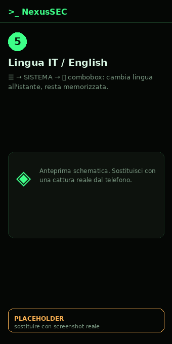

# Manuale d'uso — Termux-NexusSEC-OS

Guida semplice, passo per passo, per un utente medio. Ti serve solo un telefono
**Android** (senza root). Tutto il resto lo fai una volta e poi comandi dall'app.

> ⚠️ **Uso legale.** Usa questi strumenti **solo** su reti, siti e dispositivi
> tuoi o per cui hai un permesso scritto. L'uso non autorizzato è reato.

---

## In breve (cosa stai per fare)

1. Installi **Termux** (un'app che dà un terminale Linux su Android).
2. Con 6 righe incollate una sola volta, scarichi e installi NexusSEC-OS.
3. Apri l'app nel browser: da lì fai **tutto** (aggiornamenti, installazioni,
   avvio degli strumenti) **senza più scrivere comandi** in Termux.

---

## Passo 1 — Installa Termux (l'app terminale)

⚠️ **Non usare la versione del Play Store** (è vecchia e non si aggiorna).

Scegli **uno** di questi modi:

- **Consigliato — pagina download del progetto:**
  apri sul telefono → **https://redrider21.github.io/Termux-NexusSEC-OS/**
  e tocca il pulsante giusto (di solito **arm64-v8a**).
- **Oppure F-Droid:** https://f-droid.org/en/packages/com.termux/
- **Oppure APK ufficiale GitHub:** https://github.com/termux/termux-app/releases/latest

Dopo il download, Android chiederà il permesso di installare da "origini
sconosciute": **accetta**. Poi apri **Termux**.

---

## Passo 2 — Installa NexusSEC-OS

### Modo facile: una riga sola (consigliato)

Apri Termux e incolla **questa unica riga** (tieni premuto → *Incolla*, poi Invio).
Fa tutto da sola: aggiorna, scarica, installa, avvia il server e apre l'app.
Scarica ~700 MB–1 GB: **meglio sotto Wi-Fi**.

```bash
pkg install -y curl && curl -fsSL https://raw.githubusercontent.com/RedRider21/Termux-NexusSEC-OS/master/nexussec-setup.sh | bash
```

> Vuoi anche l'avvio automatico all'accensione? Usa:
> `pkg install -y curl && curl -fsSL https://raw.githubusercontent.com/RedRider21/Termux-NexusSEC-OS/master/nexussec-setup.sh | AUTOSTART=1 bash`

Quando finisce, sei già pronto: salta al **Passo 4** (l'app è su `http://127.0.0.1:8000`).

### Modo manuale (se preferisci vedere ogni passaggio)

```bash
pkg update -y && pkg upgrade -y
termux-setup-storage
pkg install -y git python
git clone https://github.com/RedRider21/Termux-NexusSEC-OS.git
cd Termux-NexusSEC-OS
bash install.sh
```

`install.sh` installa gli strumenti base, prepara il piccolo Debian di supporto e
Tor. Aspetta che finisca (qualche minuto).

---

## Passo 3 — Avvia l'app

Sempre in Termux, dalla cartella del progetto:

```bash
python server.py
```

Vedrai una riga tipo *"Uvicorn running on http://127.0.0.1:8000"*.
**Lascia Termux aperto** e apri il **browser** del telefono su:

> **http://127.0.0.1:8000**

Questa è l'interfaccia (una web-app). Da qui in poi comandi da qui.

> 💡 **Come funziona (in una frase):** Termux fa girare un piccolo *server locale*
> sul telefono (solo sul telefono, `127.0.0.1`); l'app nel browser gli parla e lui
> lancia gli strumenti per te e ti mostra i risultati.

---

## Passo 4 — Usa l'app

- **Home:** le schede degli strumenti, divise per categoria.
- **Ogni scheda** ha un'etichetta che dice cosa fa il tocco:
  - `» run` → esegue e mostra il risultato;
  - `▮ terminale` → apre un terminale interattivo;
  - `◈ flusso live` → **output in diretta** con possibilità di **rispondere**
    (prova la scheda **"Recon demo (flusso live)"**);
  - `＋ da installare` → non è installato: tocca per installarlo (vedi sotto);
  - `❌ non su stock` → non funziona su telefono senza root (spiegato al tocco).
- **🧅 Tor:** instrada il traffico via Tor (per i tool che lo supportano).
- **🧰 Catalogo:** mostra anche i tool non ancora installati.
- **🎨 Tema:** cambia l'aspetto (Terminale, Glass, Neon, Minimal chiaro/scuro).
- **🌐 Lingua:** l'app è tutta in **Italiano** o **English** (interfaccia, schede
  dei tool, tooltip, guida, messaggi e output delle procedure). Si sceglie da
  **☰ → SISTEMA → 🌐** con una combobox; vedi *[Aggiornare l'app](#aggiornare-lapp-fase-completa)*.
- **Barra in basso (stile desktop):** pulsante **NexusSEC** = menu, ⌨️ **Shell
  (pannello)** = una shell dentro l'app dove scrivi comandi liberi (consigliata sul
  telefono: niente auto-maiuscola), 🧅 Tor, orologio. Dal menu trovi anche **▮
  Terminale ttyd** (terminale vero, ma la maiuscola dipende dalla tastiera).
- **🧙 Wizard:** tocca il **riquadro `>_`** in alto a sinistra per aprire il pannello
  (a tutto schermo). Sono **sequenze automatiche di comandi** per profilo: scegli un
  wizard, inserisci il bersaglio (IP/host o file) e parte la catena — **l'output di
  un passo alimenta il successivo** (es. le porte trovate da nmap vanno in Nikto).
  Ci sono 6 wizard pronti (Pentest, Pentest Lite, Web, OSINT, Forensics, Reverse) e
  puoi **crearne di tuoi** con **＋ Nuovo wizard** (scegli programma + parametri;
  runtime e verifica "installato" si impostano da soli), **modificarli** o
  **eliminarli**; i predefiniti si **duplicano** per partire da una base.

<table>
<tr>
<td align="center" width="50%"><br><sub><b>1.</b> Pannello Wizard aperto</sub></td>
<td align="center" width="50%"><br><sub><b>2.</b> Bersaglio + avvio sequenza</sub></td>
</tr>
</table>

> I wizard eseguono comandi veri: **solo su sistemi autorizzati**.

---

## Passo 5 — Fai tutto dall'app (senza toccare Termux)

Tocca **NexusSEC** (in basso a sinistra) per aprire il menu:

- **MANUTENZIONE**
  - **⟳ Aggiorna Termux** — aggiorna i pacchetti di sistema.
  - **⬇ Aggiorna app** — scarica l'ultima versione del progetto (`git pull`).
  - **🐧 Aggiorna Debian** — aggiorna il Debian di supporto.
  - **⏻ Riavvia server** — riavvia l'app (usalo **dopo "Aggiorna app"**).
- **Installare uno strumento:** tocca una scheda `＋ da installare` → **⬇ Installa
  ora**. Vedi l'installazione **in diretta**; a fine, il pulsante diventa attivo.
- **Installare un profilo intero** (es. *web*, *osint*): scegli il profilo dal menu
  → banner **⬇ Installa profilo** → **Installa ora**. Installa in blocco i mancanti.

Ogni operazione mostra il suo output live: se qualcosa va storto, lo vedi subito.

### Aggiornare l'app (fase completa)

Quando su GitHub esce una versione nuova, l'app te lo dice con un **pallino
arancione** ● sul pulsante **☰ NexusSEC** (lo controlla da sola con `git fetch`).

<table>
<tr>
<td align="center" width="20%"><br><sub><b>1.</b> Pallino ● sul ☰</sub></td>
<td align="center" width="20%"><br><sub><b>2.</b> ⬇ Aggiorna app</sub></td>
<td align="center" width="20%"><br><sub><b>3.</b> Flusso live + resoconto</sub></td>
<td align="center" width="20%"><br><sub><b>4.</b> ⏻ Riavvia server</sub></td>
<td align="center" width="20%"><br><sub><b>5.</b> 🌐 Lingua IT/EN</sub></td>
</tr>
</table>

1. Vedi il **pallino arancione** ● sul ☰ → c'è un aggiornamento.
2. **☰ → MANUTENZIONE → ⬇ Aggiorna app** (mostra anche «● N aggiornamenti»).
3. Scorre il **flusso live**: `git` allinea a `origin/master` e stampa un
   **RESOCONTO** con la versione ora installata.
4. Parte da sola **⏻ Riavvia server** (serve perché il Python in memoria è ancora
   quello vecchio); dopo qualche secondo la **pagina si ricarica**. Se non lo fa,
   ricaricala tu.
5. **Lingua:** **☰ → SISTEMA → 🌐**, scegli *Italiano* o *English*. Cambia subito e
   resta memorizzata.

> **⚠️ Se «Aggiorna app» fallisce** (updater vecchio, o «dubious ownership» di git
> in Termux), sbloccalo **una sola volta** da Termux, poi usa **⏻ Riavvia server**:
>
> ```bash
> cd ~/Termux-NexusSEC-OS \
>   && git -c safe.directory='*' fetch origin \
>   && git -c safe.directory='*' reset --hard origin/master
> ```
>
> Da lì in poi basta il pulsante. *(Nota: la cache della PWA cambia a ogni release,
> es. `nexussec-v30`, così le novità si vedono dopo il riavvio.)*

---

## Passo 6 (consigliato) — Rendila comoda come un'app vera

### App NexusSEC (launcher APK) — avvia tutto da sola

Se installi l'app **NexusSEC** (l'APK launcher dalle Release del progetto), all'avvio
mostra il logo **NexusSEC x Android** e **prova ad avviare il server da sola** dentro
Termux (non devi più aprire Termux a mano). Perché funzioni:

1. Installa **Termux** e lancia `install.sh` almeno una volta (abilita in automatico
   `allow-external-apps=true`, il permesso che consente all'app di avviare il server).
2. Se avevi Termux **già aperto** prima di quell'install, **chiudilo e riaprilo** una
   volta (o esegui `termux-reload-settings`).
3. Apri l'app **NexusSEC**: vedrai lo **splash** con il logo *NexusSEC x Android* e un
   **avviso d'uso legale**. Intanto l'app avvia il server in background; quando compare
   *"server pronto ✓"* tocca **Entra ▸** per accedere all'interfaccia. (Se tocchi
   *Entra* prima che sia pronto, l'app entra da sola appena lo è.)
4. Se il server non parte da solo (alcuni telefoni bloccano l'avvio in background),
   l'app mostra **Apri Termux** e **↻ Riprova**: tocca **Apri Termux** — il server
   parte **all'apertura di Termux** — poi torna all'app: si collega da solo (o tocca
   **Entra**).

> La prima volta Android potrebbe chiederti di consentire l'esecuzione: accetta.
> Da ora il server parte **automaticamente ogni volta che apri Termux** e resta attivo.

- **Icona in Home (alternativa senza APK):** nel browser, menu → *"Aggiungi a schermata
  Home"*. Così apri NexusSEC come un'app a schermo intero (ma il server lo avvii tu).

### Avvio automatico all'accensione (autostart)

Così `server.py` parte da solo e non devi più aprire Termux a mano.

1. Installa l'app **Termux:Boot** (dalla pagina download del progetto o da F-Droid).
2. Nell'app NexusSEC: menu **NexusSEC → MANUTENZIONE → 🚀 Abilita autostart**.
3. **Riavvia il telefono.** Da ora il server parte da solo; apri il browser (o
   l'icona in Home) su `http://127.0.0.1:8000`.

> In alternativa a mano, una volta sola:
> ```bash
> mkdir -p ~/.termux/boot
> cp ~/Termux-NexusSEC-OS/boot/start-nexussec.sh ~/.termux/boot/
> chmod +x ~/.termux/boot/start-nexussec.sh
> ```

### Come **fermare** l'autostart

- **Dall'app:** menu **MANUTENZIONE → 🛑 Disabilita autostart** (rimuove lo script
  di avvio). Al prossimo riavvio il server non parte più da solo.
- **A mano** (equivalente): `rm ~/.termux/boot/start-nexussec.sh`
- Per fermare il server **adesso** (senza riavviare): menu **⏻ Riavvia server** non
  lo spegne; per spegnerlo del tutto, in Termux premi **Ctrl+C** nella finestra dove
  gira, oppure: `pkill -f "python server.py"`.
- Per togliere del tutto l'avvio automatico puoi anche **disinstallare l'app
  Termux:Boot**.

## Passo 7 — Installare altri strumenti (oltre al catalogo)

Non sei limitato ai tool in elenco: menu **MANUTENZIONE → ＋ Installa pacchetto**,
scrivi il nome e scegli il repository (**📦 Termux**, **🐧 Debian**, **🐉 Kali**).
Per i pacchetti Kali, la prima volta usa **🐉 Abilita repo Kali**.

---

## Domande frequenti

- **La pagina non si apre / "server non raggiungibile".**
  Apri **Termux**: il server dovrebbe partire da solo (vedrai una riga *"NexusSEC:
  server avviato"*). Se non parte, scrivi da qualunque cartella:
  ```bash
  nexussec
  ```
  (è il comando che avvia il server; sostituisce `python server.py` e funziona anche
  se non sei nella cartella del progetto). Controlla di aver aperto **http://127.0.0.1:8000**.
- **Scrivo `python server.py` e dice che non lo trova.**
  Succede se non sei dentro la cartella del progetto. Usa invece **`nexussec`**: parte
  da qualsiasi cartella. In alternativa: `cd ~/Termux-NexusSEC-OS && python server.py`.
- **Voglio disattivare l'avvio automatico del server quando apro Termux.**
  Apri `~/.bashrc` e togli il blocco fra `# >>> NexusSEC autostart >>>` e
  `# <<< NexusSEC autostart <<<`, oppure metti `export NEXUSSEC_NO_AUTOSTART=1`.
- **Ho aggiornato l'app ma non vedo le novità.**
  Menu → **⏻ Riavvia server**, poi ricarica la pagina (a volte serve ricaricare
  due volte per via della cache).
- **Nel terminale la tastiera mi mette la maiuscola (es. `Cd` invece di `cd`).**
  È l'auto-maiuscola della tastiera del telefono. Il terminale interattivo è servito
  da *ttyd* e non possiamo forzarlo dall'app. Disattiva l'auto-maiuscola nella
  tastiera: **Gboard → Impostazioni → Correzione testo → Maiuscole automatiche: OFF**
  (i campi della web-app, invece, hanno già l'auto-maiuscola disattivata).
- **Ho lanciato uno strumento (es. nmap) ma poi non posso digitare altri comandi.**
  Le schede con `» run` sono **one-shot**: eseguono *quel* comando e ti mostrano il
  risultato, non sono una shell. Per digitare comandi liberi e concatenarli usa la
  **⌨️ Shell (pannello)** (pulsante in basso o menu): scrivi un comando, premi Invio e
  l'output scorre lì; `cd`, variabili e stato **restano** tra un comando e l'altro.
  Il campo è della web-app, quindi **niente auto-maiuscola** della tastiera. Non è un
  vero terminale (niente frecce/tab): per quello c'è **▮ Terminale ttyd**.
- **Un tool dice "❌ non su stock".**
  Alcuni strumenti (Wi-Fi in monitor mode, attacchi MITM, programmi grafici) non
  possono funzionare su Android senza root: sono elencati solo per completezza.
- **Serve tanto spazio?**
  L'installazione completa occupa ~700 MB–1 GB. Puoi installare solo i profili che
  ti servono.

---

## Nota di sicurezza

Il server ascolta **solo** su `127.0.0.1` (il telefono stesso): non è raggiungibile
da altri sul Wi-Fi. I comandi vengono costruiti dall'app in modo sicuro (nessun
testo libero passato alla shell) e solo gli strumenti in elenco possono partire.

Buon lavoro — e ricorda: **solo test autorizzati**.
